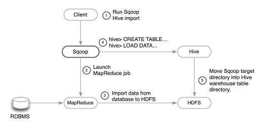

Individual Contribution:
------------------------

Hadoop Installation
------------------
| Since the main aim of our project is to determine which student is gaming , we achieve this by parsing the log files generated at the server side when a student is taking a course on Edx.Log entries are generated on a massive scale , so we cant process it on normat DBMS. For that we need to install hadoop which is a mapreduce system.The approach taken by MapReduce may seem like a brute-force approach. The premise
is that the entire dataset—or at least a good portion of it—is processed for each query.But this is its power. MapReduce is a batch query processor, and the ability to run an ad hoc query against your whole dataset and get the results in a reasonable time is transformative. 
Hadoop’s HDFS is a highly fault-tolerant distributed file system and, like Hadoop in general, designed to be deployed on low-cost hardware. It provides high throughput access to application data and is suitable for applications that have large data sets. For that we installed hadoop in two different scenario:-

:Standalone:
             
* By default, Hadoop is configured to run in a non-distributed or standalone mode
* HDFS is not utilized in this mode.
* Local file system is used for input and output
* There are no daemons running and everything runs in a single JVM instance.
* No Custom Configuration is required in 3 hadoop(mapred-site.xml,core-site.xml, hdfs-site.xml) files.
* Standalone mode is much faster than Pseudo-distributed mode.

:Multinode:

* This is a Production Phase
* Data are used and distributed across many nodes.
* Different Nodes will be used as  Master Node / Data Node / Job Tracker / Task Tracker
* The Hadoop daemons run on a local machine, and the cluster is simulated on all the machines included in cluster.
Prerequisites
 for hadoop installation is  a working Java 1.5+ (aka Java 5) installation.For installation procedure of hadoop , refer to the above topics.

HIVE installation
------------------
| Hive was created to make it possible for analysts with strong SQL skills (but meagerJava programming skills) to run queries on the huge volumes of data . Hive is used by many organizations as a general-purpose, scalable data processing platform.SQL is the lingua franca in s intelligence tools (ODBC is a common bridge, for example), so Hive is well placed to integrate with these products .Hive runs on our workstation and converts  SQL query into a series of MapReduce jobs for execution on a Hadoop cluster. Hive organizes data into tables,
which provide a means for attaching structure to data stored in HDFS. Metadata such as table schemas—is stored in a database called the metastore.

| Installation of Hive is straightforward. Java 6 is a prerequisite.You also need to have the same version of Hadoop installed locally that your cluster is running. Of course, we may choose to run Hadoop locally,either in standalone or multinode mode, while getting started with Hive.The proper procedure for installing hive is mentioned in the above topics.

| Hive provides several services that you can run using the hive command.Out of those , we have used hiveserver service of hive to connect the JAVA program to HIVE using JDBC driver.

Sqoop Installation
------------------
        
| Sqoop is an open-source tool that allows users to extract data from a relational database into Hadoop for further processing.
This processing can be done with MapReduce programs or other higher-level tools such as Hive.When the final results of an analytic pipeline are available, Sqoop can export these results back to the database for consumption by other clients.The proper procedure for installation of sqoop is mentioned above.

| We have basically used sqoop for importing data from SQL into HIVE.We have used two different command for import.One is to import a single table and the other one is the import of the whole database.
        

 

After all the installation procedures, we studied the research paper, “Detecting Student Misuse of Intelligent Tutoring Systems” authored by Ryan Shaun Baker, Albert T. Corbett, Kenneth R. Koedinger and gave a presentation on it. Their study says that students who are averted to such ‘gaming the system behaviour’ (behavior aimed at obtaining correct answers and advancing within the tutoring curriculum by systematically taking advantage of regularities in the software’s feedback and help) learn 2/3rds as much as similar students who do not engage in such behaviors. They came up with a machine-learned latent response model that can identify whether a student is gaming the system or not. Based on these predictions, the tutor can be re-designed for such students and make their learning process effective.

Baker and his colleagues found that a student’s frequency of gaming was strongly negatively correlated with learning. According to them, understanding why students game the system will be essential in deciding how the system should respond. Ultimately, though, whatever remediation approach is chosen, it is likely to have costs as well as benefits. For instance, preventive approaches, such as changing interface widgets to make them more difficult to game or delaying successive levels of help to prevent rapid-fire usage, may reduce gaming, but at the cost of making the tutor more frustrating and less time-efficient for other students. Since many students use help effectively and seldom or never game the system, the costs of using such an approach indiscriminately may be higher than the rewards. Whichever approach we take to remediating gaming the system, the success of that approach is likely to depend on accurately and automatically detecting which students are gaming the system and which are not.

The LRM they suggested, takes 24 features as input or data source and also the predetermined value of the student ‘gaming or not’ of a training set of 70 students. Then it uses forward selection for model selection and then finally implements iterative gradient descent to find the best model parameters. The best-fitting model had 4 parameters, and no model considered had more than 6 parameters. They also used a cross-validation techninque, LOOCV (Leave One Out Cross Validation). Finally with the ROC (Receiver Operating Characteristic) curve, they classified the student as gaming or not gaming. On this result, they applied the interventions in the ITS.

Similar to these idealogies, we extracted the relevant features from the parsed log data and mapped them into suitable forms for implementing machine learning. This process involved rigorous study of the various events generated on the edX server. A simple example of the log file is as follows:

.. image:: prettyprint.png

Command to get this is:

cat tracking.log | jq'.'

The jq '.' is a command by which the log files get pretty printed. The JSON object 'event_source' is the most important feture we are dealing with. All the entries in the tracking.log file get parsed into the log table of our database. There is an entry corresponding to every event generated in the log files. Different types of events are generated. Common fields of those events are as follows:-
 
:Agent:
| Browser agent string of the user who triggered the event
:Context:
| For all events, this field includes member fields that identify:
   * The course_id of the course that generated the event. 
   * The org_id of the organization that lists the course. 
   * The user_id of the individual who is performing the action. 
:Event:
| This field includes member fields that identify specifics of each triggered event.
:event_source:
| Specifies whether the triggered event originated in the browser or on the server.
:event_type:
| The type of event triggered.
:Host:
| The site visited by the user, for example, courses.edx.org.
:ip:
| IP address of the user who triggered the event.
:page:
| The '$URL' of the page the user was visiting when the event was emitted.
:session:
| This 32-character value is a key that identifies the user's session.
:time:
| Gives the UTC time at which the event was emitted in 'YYYY-MM- DDThh:mm:ss.xxxxxx' format.
:username:
| The username of the user who caused the event to be emitted. This string is empty for anonymous events, such as when the user is not logged in.
  
| Each and every event has its own attributes. Various types of events generated which we have used are as follows:-

* Problem_check generated at two sources , browser and server.
* Problem_show
* load_video
* play_video
* speed_change_video
* seek_video
* pause_video  

The entries of log files are parsed and then stored in database which has the following tables.
:Log:
| This table stores the common log entries of all types of events and has the  folllowing fields:- 
* id
* course_id
* org_id
* user_id
* event_type
* event_type
* event_source
* host
* ip
* page
* time
* username  

   
:load_video:
| This table stores details of log entries whose event_type is load_video.Here the log_id corresponds to the id of log table.This table has   the following columns:-
* log_id
* code

:pause_video:
| This table stores details of log entries whose event_type is pause_video. Here the log_id corresponds to the id of log table.This table has the following columns:-

* log_id
* code
* current_time

:play_video:
| This table stores details of log entries whose event_type is play_video.  Here the log_id corresponds to the id of log table.This table has the following columns:-
* log_id
* code
* current_time

:problem_check_browser:
| This table stores details of log entries whose event_type is problem_check and event source is browser. Here the log_id corresponds  to the id of log table.This table has the following columns:-
* log_id
* problem_id

:problem_check_server:
 This table stores details of log entries whose event_type is problem_check and event source is server.  Here the log_id corresponds  to the id of log table.This table has the following columns:-
* log_id
* problem_id
* hint
* hintmode
* correctness
* response_type
* input_type

:problem_show:
| This table stores details of log entries whose event_type is problem_show.  Here the log_id                 corresponds  to the id of log table.This table has the following columns:-
* log_id
* problem_id

:seek_video:
| This table stores details of log entries whose event_type is seek_video.  Here the log_id                 corresponds  to the id of log table.This table has the following columns:-
* log_id
* code
* old_time
* new_time

:speed_change_video:

| This table stores details of log entries whose event_type is speed_change_video.  Here the log_id   corresponds  to the id of log table.This table has the following columns:-
* log_id
* code
* current_time
* old_speed
* new_speed

:load_video:

This table stores details of log entries whose event_type is load_video.  Here the log_id corresponds  to the id of log table.This table has the following columns:-
* log_id
* code

:status:
This table stores the attributes related to the log files and the files which have been archived. Some examples are size, line read, date modified, seek_time_processed, attempts_processed etc.
* name
* int   
The status table is basically used for implementing incremental queries. The 'name' entry corresponding inint entry stores the latest log id which has already been processed. So when the processing has to be done for the next time, the processing starts from this value.

After the classification has been done, queries were written on the tables to extract the features required for implementing machine learning.

Importing data from mysql to hive:
----------------------------------

The database schema above defined was first made in mysql. Then it was imported into hive by sqoop. But later on, we came up with a method by which we could directly connect with hive from the java program.

Feature Extraction:
-------------------

After the the whole log extraction was completed, it was necessary to extract feature for implementation of machine learning. One of those features is to calculate the amount of time a user seeked a video. For this, the details of a video is also required. As such information wasn't provided, a project named 'Download'(package name 'fetch_video_information') was written to extract the details of a video.

The table created for this purpose was 'video_information'. The steps involved in this program are:

1. Fetch the video code from the log parsed database('load_video' table) in the Database class.
2. Pass this video code into the URL (in the Down class): http://gdata.youtube.com/feeds/api/videos/"+video_code+"?v=2&alt=jsonc Example - http://gdata.youtube.com/feeds/api/videos/dXb3Tx8V4hU?v=2&alt=jsonc opens the following :- ::

   {"apiVersion":"2.1","data":{"id":"dXb3Tx8V4hU","uploaded":"2013-02-23T11:16:41.000Z","updated":"2013-02-23T11:16:41.000Z","uploader":"aakashlab","category":"People","title":"Android UI and Layouts part 2","description":"","thumbnail":{"sqDefault":"http://i1.ytimg.com/vi/dXb3Tx8V4hU/default.jpg","hqDefault":"http://i1.ytimg.com/vi/dXb3Tx8V4hU/hqdefault.jpg"},"player":{"default":"http://www.youtube.com/watch?v=dXb3Tx8V4hU&feature=youtube_gdata_player","mobile":"http://m.youtube.com/details?v=dXb3Tx8V4hU"},"content":{"5":"http://www.youtube.com/v/dXb3Tx8V4hU?version=3&f=videos&app=youtube_gdata","1":"rtsp://r2---sn-a5m7zu7z.c.youtube.com/CiILENy73wIaGQkV4hUfT_d2dRMYDSANFEgGUgZ2aWRlb3MM/0/0/0/video.3gp","6":"rtsp://r2---sn-a5m7zu7z.c.youtube.com/CiILENy73wIaGQkV4hUfT_d2dRMYESARFEgGUgZ2aWRlb3MM/0/0/0/video.3gp"},"duration":308,"viewCount":371,"favoriteCount":0,"commentCount":0,"accessControl":{"comment":"allowed","commentVote":"allowed","videoRespond":"moderated","rate":"allowed","embed":"allowed","list":"allowed","autoPlay":"allowed","syndicate":"allowed"}}}

3. The above URL opens a page containing the JSON object about that video. So, next we downloaded this piece of information into a file.

The code snippet for the same looks like : ::
URL url = new URL("http://gdata.youtube.com/feeds/api/videos/"+video_code+"?v=2&alt=jsonc");
	
		Scanner s = new Scanner(url.openStream());
		String line;
		while(s.hasNext())
		{
			line=s.nextLine();
			File file = new File("/home/dell/workspace/Download/src/videoJson.json");
			 
			// if file doesnt exists, then create it
			if (!file.exists())
			{
				file.createNewFile();
			}
 
			FileWriter fw = new FileWriter(file.getAbsoluteFile());
			BufferedWriter bw = new BufferedWriter(fw);
			bw.write(line);
			bw.close();
 			
			System.out.println(line);
			
			JsonParser.parseJson(video_code);
		}
4. Then, we parsed out the objects, title and duration from this JSON object (in the JsonParser class).

The code snippet for the same looks like : ::
                 JSONObject obj = new JSONObject(jsonStr);
		 String title = obj.getJSONObject("data").getString("title");
		 System.out.println(title);
		 JSONObject obj2 = new JSONObject(jsonStr);
		 int duration = (int) obj2.getJSONObject("data").get("duration");
		 System.out.println(duration);
		 Database.putdata(video_code,title,duration);

5. Finally this information was stored back in the table 'video_information' (in the Database class).

This process was repeated for all video codes.(Run the Download only when new entries are required)

Connection with hive was made by using the Connect class and most importantly, the project should have the following jar files incuded:

* apache-logging-log4j.jar
* commons-httpclient-3.0.1.jar
* commons-logging-1.1.3.jar
* hadoop-core-1.2.0.jar
* hive-cli-0.13.0.jar
* hive-common-0.13.0.jar
* hive-exec-0.13.0.jar
* hive-jdbc-0.13.0.jar
* hive-metastore-0.13.0.jar
* hive-service-0.13.0.jar
* hive.txt
* libfb303-0.9.0.jar
* libthrift-0.9.0.jar
* log4j-1.2.16.jar
* slf4j-api-1.7.7.jar
* slf4j-jdk14-1.7.7.jar

The Connect class code snippet looks like : ::

    Class.forName("org.apache.hadoop.hive.jdbc.HiveDriver");
    Connection connect = DriverManager.getConnection("jdbc:hive://localhost:10000/exptnew", "", "");
    System.out.println("Connected successfully");
    return(connect);

After the video_information table is ready, the main queries for extraction of seek time can be implemented.

:Extracting the amount of time a student seeked(or skipped) a video: 

This feature is concerned with extracting the amount of time a student has skipped a portion of the video. If a student is seeking a video more than the amount of his/her viewed time, then the student is likely not interested in the course (But it is also possible that a student is skipping one video only beacuse he/she has some knowledge about that topic. This is difficult to track beacuse we cannot estimate a student's knowledge on a specific topic. And it is very rare to find a student who will seek almost all the videos in a given course, provided that he/she already knows about this topic. In that case the student wouldn't have selected the course. As we are keeping track of the seek time of all videos in a course for each student, the case of a student seeking just one or two odd videos beacause he/she had some previous knowledge in it will be handled in the mapping function later described in futher topic).

The  java class written for this purpose is Feature_seek_time. The following snippet fulfills the above described functionality :::

   statement.executeQuery("drop table temp0");
   statement.executeQuery("create table temp0(code string,username string,seek int)");
   statement.executeQuery("create table seek_time_total(code string,username string,seek int,title string,duration int)");
   statement.executeQuery("insert into table temp0 select sv.code,sv.username,sum(sv.new_time-sv.old_time) from seek_video sv where log_id>="+start+" and log_id<"+end+" and not exists(select * from temp0 t2 where sv.code=t2.code and sv.username=t2.username) group by sv.code,sv.username ");
   resultset=statement.executeQuery("select * from temp0");
   statement.executeQuery("insert overwrite table seek_time_total select a.code,a.username,a.seek,b.title,b.duration from temp0 a join  video_information b on a.code=b.code");
   resultset=statement.executeQuery("select * from seek_time_total");
   while(resultset.next())
   {
   System.out.println(resultset.getString(1)+"\t"+resultset.getString(2)+"\t"+resultset.getString(3)+"\t"+resultset.getString(4)+"\t"+resultset.getString(5)+"\t");
   }
   statement.executeQuery("insert overwrite table status select name, instring, case when name='seek_time_processed' then "+end+" else inint end as inint from status");

The sample output space looks like :
  ===========   ======== ====    =============================   ========
  code		username seek    title                           duration
  ===========   ======== ====    =============================   ========
  RU2qJTO0Gms	ak	 764	 IntroductionToAndroidPart1      927	
  RU2qJTO0Gms	sachin   696	 IntroductionToAndroidPart1	 927	
  KdX4DaFRAKU	ak	 440	 Android UI and Layouts part-1	 415	
  KdX4DaFRAKU	oshin	 26	 Android UI and Layouts part-1	 415	
  2E_KTtnbzVU	sachin   269	 Android UI and Layouts part 3	 395	
  aI1uMZMmnY8	sachin   181	 Android UI and Layouts part 5	 351	
  d45uLZEU5U0	oshin	 758	 Introduction To Android Part2	 782	
  ===========   ======== ====    =============================   ========
To execute this query, we used an intermediate table named temp0. The table temp0 holds the 11 digit code of the video, username and seek time of a user whose entry for a particular video code is not present in the table. The seek time has been claculated by the difference in the new_time and old_time fields in the seek_video table. Only those entries are considered while query execution which have not been processed yet. This has been taken care by the status table entry 'seek_time_processed' which contains the log_id of the user who's entry has been processed last. This is yet another example of an incremental query which uses two variables 'start' and 'end' to implement this concept.

Then the table 'seek_time_total' finally contains the code, username, seek time(in seconds), title and duration of the video(in seconds). The video_information table gives the details about the title and duration of the video in seconds.

:Points to be noted:

1. The statements drop table temp0, creation of temp0 and seek_time should be executed for the first time only and then comment these lines once done.
2. Also, if a student has seen the video completely then a pause event is generated and no special event as to whether he/she has completed watching the video or not is not generated. Thus there will be a problem when a student has almost seen the video and also when the video will be watched multiple times.

Next comes the work of mapping the features into suitable formats.

:Mapping the seek_time feature:

We have written a java class Map_feature_seek_time. In this for each user, we have calculated :

**[sum{(duration/(duration+seek))*10}]/number of videos seeked**

(Say, d = duration and s = seek time.)

i.e, the sum of the fraction (d/(d+s)) multiplied by 10 (so that the range of a student's seek time remains within 10), divided by the total number of videos he/she has seeked.

If the grade is closer to 10 then the student is regular and seeks less else the student is seeking most of the videos.

The code snippet for the above is: ::

   statement.executeQuery("insert into table feature_seek select username,sum((duration/(duration+seek))*10)/count(*) from seek_time_total group by username");
   statement.executeQuery("insert into table feature select a.username,0,0,0,0 from feature_seek a where not exists(select * from feature where username=a.username)   ");

